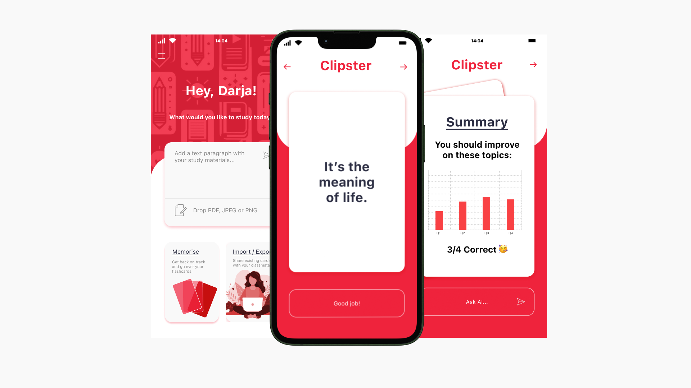

## Clipster: Hack4AI Riga 2024 Winner

**AI-generated flashcards app for studying based on pdf/text input**

Having a hard time studying for exams? Well don't worry, we got you covered!

_Say goodbye to the stress and anxiety from studying._

### Problem

In today's fast-paced educational environment, traditional study methods just don't cut it. Simply upload your pdfs or text books into Clipster, and our AI will turn them into interactive flashcards, designed for both students and teachers.
Key Features:

- Personalized Learning: Dive into a customized study experience as Clipster's AI generates flashcards based on your text prompt or pdf material.

- Instant flashcards from your pdfs: Just click and drop and you will get custom tailored set of flashcards for your needs.

- Progress Tracking & Feedback: Stay on top of your study game with progress reports and feedback to help you understand where you need focus.

- Interactive Study Sessions: Teachers can create dynamic flashcards designed to make learning interactive and fun.

### Transform Your Study Habits:

Clipster is more than just an app; it's your personal study companion. It encourages, motivates, and guides you through your educational journey, breaking down complex subjects to help you revise for exams.

Feel free to give our app a try! Start your journey now towards smarter and more effective learning.

https://hack4ai-clipster.vercel.app/

